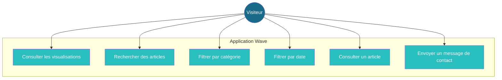
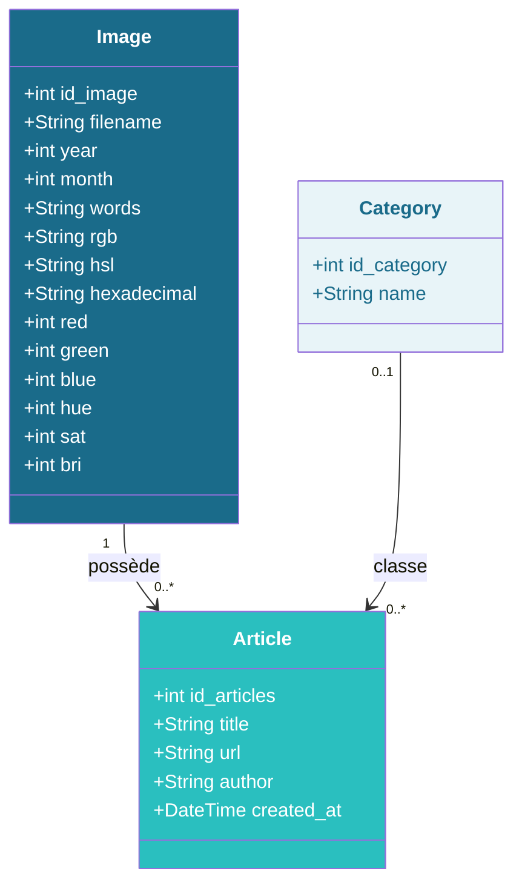
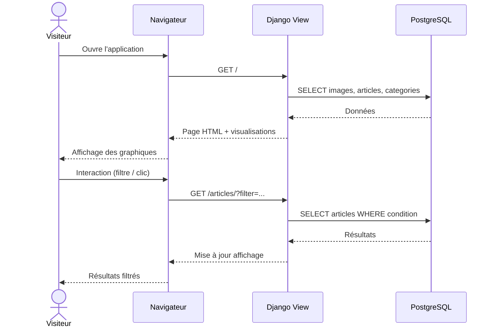
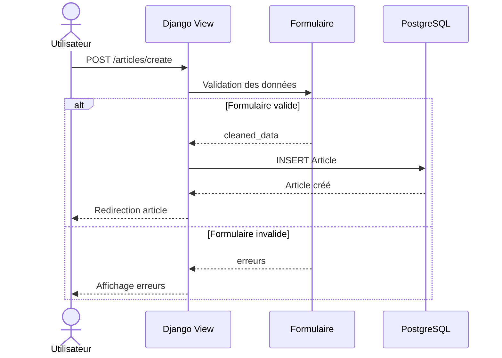
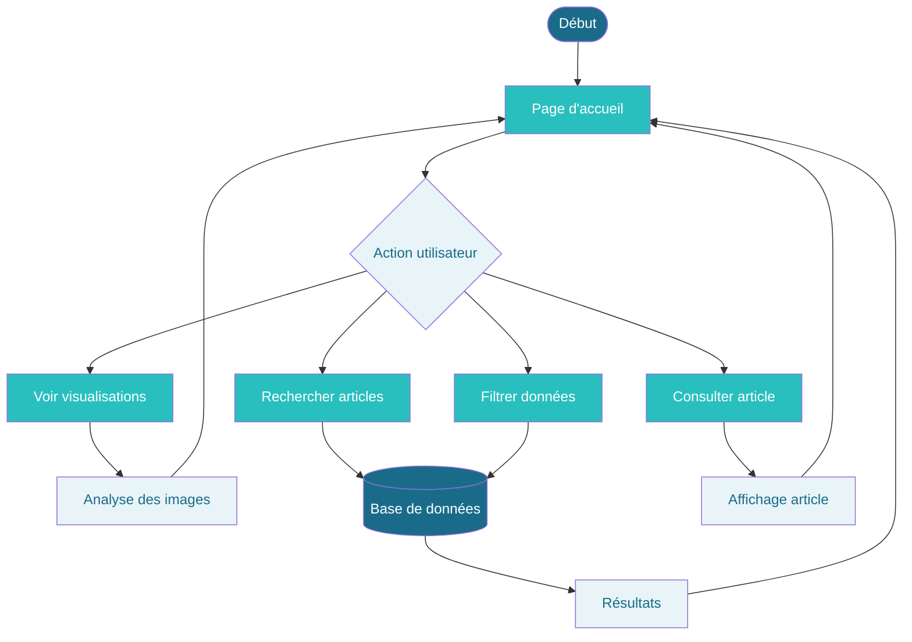
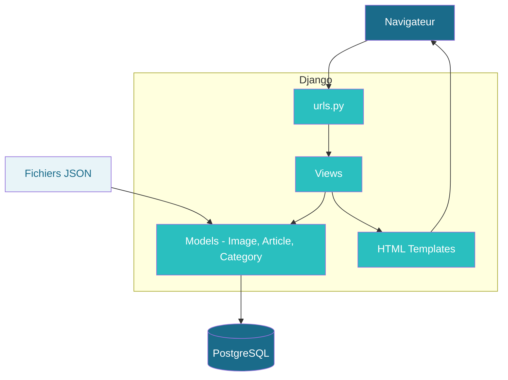
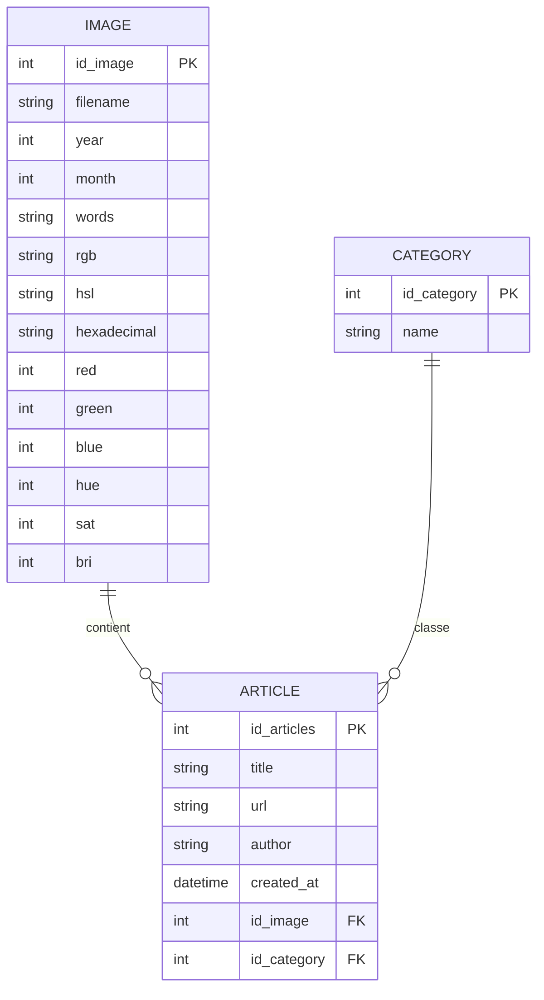

# 📐 Documentation UML — Wave

> Diagrammes d'architecture et modélisation du projet Wave (Django/Python)

---

## Table des matières

- [📐 Documentation UML — Wave](#-documentation-uml--wave)
  - [Table des matières](#table-des-matières)
  - [1. Diagramme de cas d'utilisation](#1-diagramme-de-cas-dutilisation)
  - [2. Diagramme de classes](#2-diagramme-de-classes)
  - [3. Diagramme de séquence — Chargement des visualisations](#3-diagramme-de-séquence--chargement-des-visualisations)
  - [4. Diagramme de séquence — Création de contenu](#4-diagramme-de-séquence--création-de-contenu)
  - [5. Diagramme d'activité](#5-diagramme-dactivité)
  - [6. Diagramme de composants](#6-diagramme-de-composants)
  - [7. Modèle Entité-Relation (ER)](#7-modèle-entité-relation-er)

---

## 1. Diagramme de cas d'utilisation

---

## 2. Diagramme de classes

---

## 3. Diagramme de séquence — Chargement des visualisations

---

## 4. Diagramme de séquence — Création de contenu

---

## 5. Diagramme d'activité

---

## 6. Diagramme de composants

---

## 7. Modèle Entité-Relation (ER)

---

