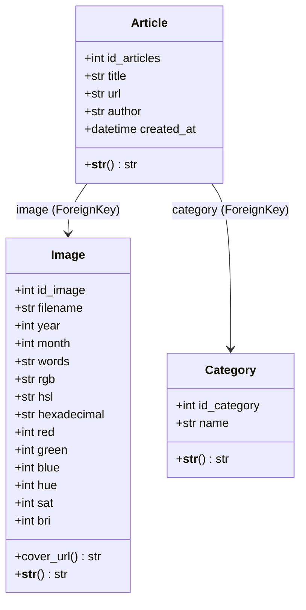
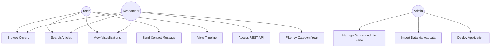
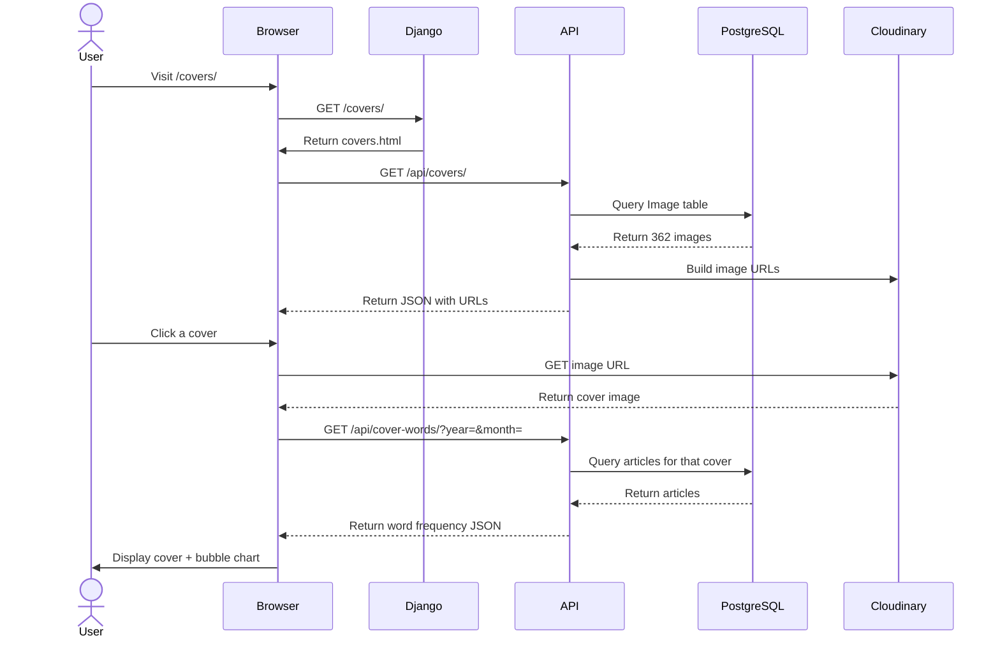
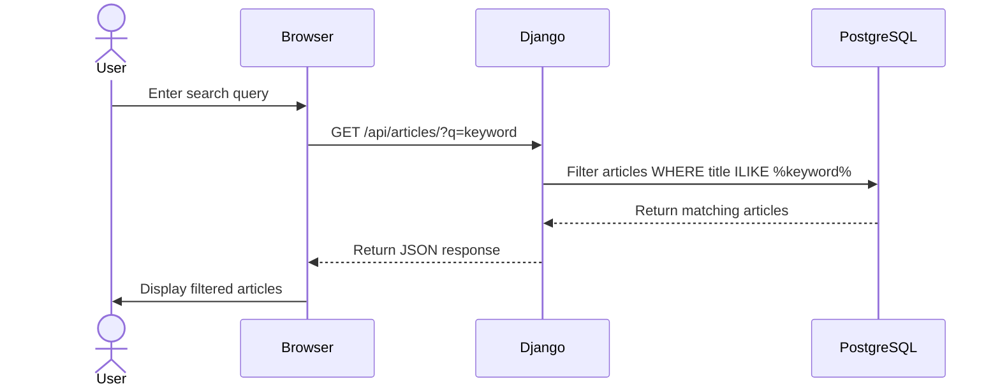
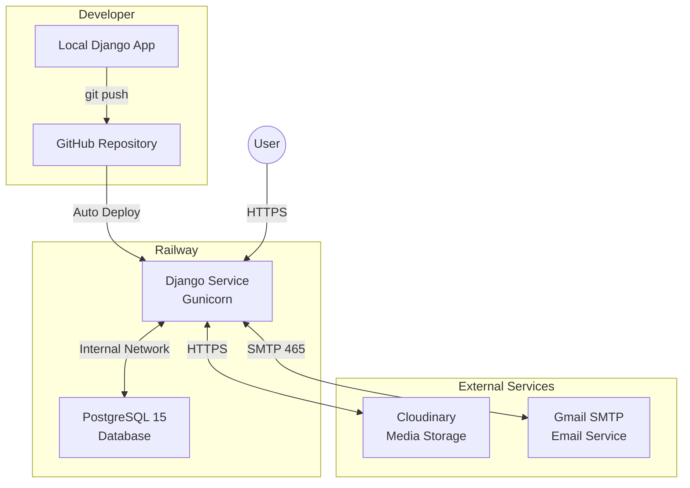

# UML Diagrams — WAVE Project

## 1. Class Diagram



---

## 2. Use Case Diagram



---

## 3. Sequence Diagram — Browse Covers



---

## 4. Sequence Diagram — Search Articles



---

## 5. Deployment Architecture Diagram



---

## 6. MCD (Modèle Conceptuel de Données)

```
┌─────────────────┐         ┌─────────────────┐
│    CATEGORY     │         │      IMAGE      │
├─────────────────┤         ├─────────────────┤
│ id_category (PK)│         │ id_image (PK)   │
│ name            │         │ filename        │
└────────┬────────┘         │ year            │
         │                  │ month           │
         │ 0,N              │ hexadecimal     │
         │                  │ hue             │
    ┌────┴────────┐         │ sat             │
    │   ARTICLE   │         │ bri             │
    ├─────────────┤    1,1  │ red/green/blue  │
    │ id_articles │◄────────┤ words           │
    │ title       │         └─────────────────┘
    │ url         │
    │ author      │
    │ created_at  │
    └─────────────┘
```
